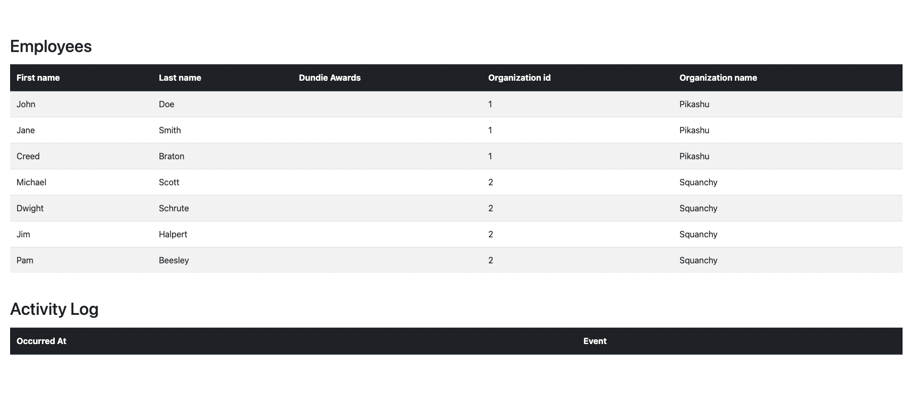

# Employee directory organization

This is an application for managing employees of a company. Employees belong to organizations within the company.

As recognition, employees can receive Dundie Awards.

* A `Dundie Award` is in reference to the TV show [The Office](https://en.wikipedia.org/wiki/The_Dundies) in which the main character hands out awards to his colleagues. For our purposes, it's a generic award.

## Running with Docker

```bash
docker compose up --build
```

This starts Postgres and the application. The app is available at <http://localhost:3000>.

Data is persisted in the `postgres-data` volume. To start from a clean database:

```bash
docker compose down -v
```

## Running locally without Docker

The app expects a Postgres instance. Start just the database with `docker compose up -d db`,
then run `./gradlew bootRun`. Connection settings can be overridden with the
`SPRING_DATASOURCE_URL`, `SPRING_DATASOURCE_USERNAME`, and `SPRING_DATASOURCE_PASSWORD`
environment variables.

## Tests

```bash
./gradlew test
```

Tests spin up a throwaway Postgres via Testcontainers, so Docker must be running. No
separate database setup is needed — the container is created and torn down per run.

## Dundie Awards

An employee can receive any number of Dundie Awards. Each award is recorded as an immutable
row — who received it, who gave it, in which organization, and when — so the history is never
rewritten. The awards table is the source of truth for totals, but each employee also carries an
`award_count` column incremented in the same transaction as the award insert, so listing employees
and ranking the leaderboard read a stored number instead of aggregating the ledger. If the counter
ever drifts, the backfill statement in `V6__add_employee_award_count.sql` rebuilds it from the rows.

An award can only be given between two employees of the **same** organization, and nobody can
award themselves.

| Method | Path | Description |
| --- | --- | --- |
| `POST` | `/dundie-awards` | Give an award. Body: `{"recipientId": 1, "giverId": 2}` |
| `GET` | `/dundie-awards?page=0&size=10` | List awards, newest first |
| `GET` | `/dundie-awards/{id}` | Fetch a single award |

```bash
curl -X POST http://localhost:3000/dundie-awards \
  -H 'Content-Type: application/json' \
  -d '{"recipientId": 1, "giverId": 2}'
```

Rejections:

| Status | When |
| --- | --- |
| `400` | `recipientId` or `giverId` missing from the body |
| `400` | Either employee does not exist (or has been deleted) |
| `400` | Giver and recipient are in different organizations, or either has no organization |
| `400` | Giver and recipient are the same employee |
| `404` | Unknown award id |

An employee's running total is exposed as `dundieAwards` on the employee endpoints.

## Deleting employees

`DELETE /employees/{id}` is a soft delete: the row is kept and stamped with `deleted_at`, so
awards given and received by that employee remain intact. A soft-deleted employee is hidden
from every read, and can no longer give or receive awards.

## API docs

With the app running, the OpenAPI schema is at <http://localhost:3000/openapi> and the
Swagger UI at <http://localhost:3000/swagger-ui.html>.

## Instructions

In preparation for the upcoming call with NinjaOne, `clone` this repo and run it locally.



Become familiar with the application and it's characteristics. Use your favorite HTTP Client (like [Postman](https://www.postman.com/)) to exercise the endpoints and step through the code to help you get to know the application.

In the call, we will introduce new code to the application, and you will comment on issues with the endpoint. Please be ready to share your screen in the call with us with the application ready to run.

**Bonus:** Spot any issues or potential improvements you notice in the application while you're familiarizing yourself and make note of them for our call. We would love to see your input in how to make this application better.
